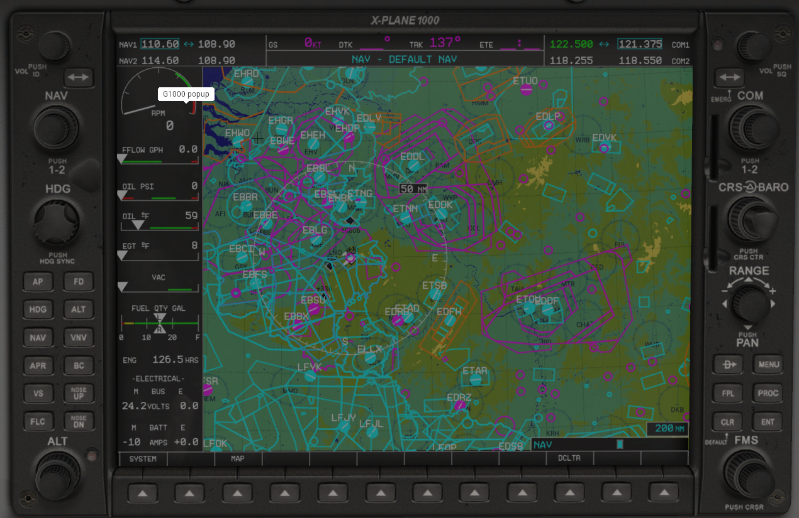

# Airspacer

Convert Airspace files from [Soaring Web](http://soaringweb.org/Airspace) to X-Plane 11 compatible files

## Usage

`airspacer <input_file> <output_file>`

## Example

`airspacer France_20-05.txt FR.txt`

and put FR.txt in ~/X-Plane 11/Custom Data/airspaces folder

## Install
```bash
mkdir build
cd build
cmake ..
make
sudo make install
```


## Garmin 1000 in Cessna 172 in X-Plane 11


